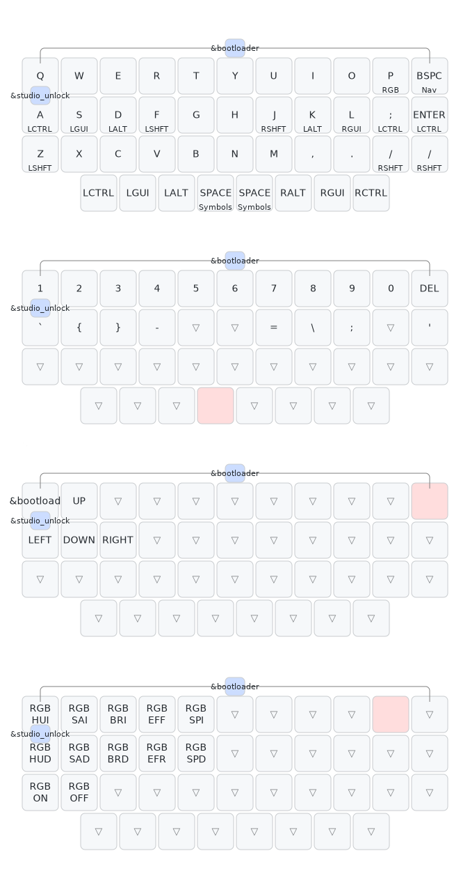

# GB34 r2 (nRF25833)

https://www.zfrontier.com/app/flow/YEak67OndXNv

The second round of GB34/#34, an 11u hotswap keyboard designed by Niuniu and Zorokb. Repository only contains BLE code for the wireless (nRF52833) PCB.

keys, underglow, studio

